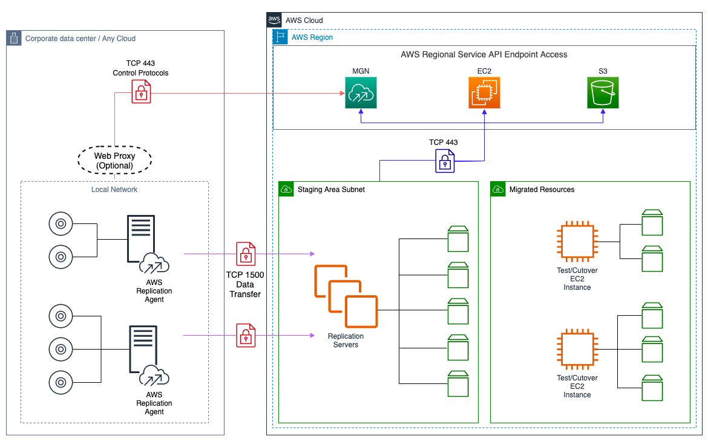
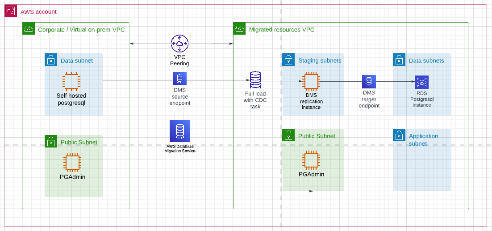

# aws-capci-mgn-lab-dms

#### Table of Contents
1. [Overview](#overview)
    * [AWS Application Migration Service(MGN)](#AWS Application Migration Service(MGN))
    * [AWS Database Migration Service(DMS)](#AWS Database Migration Service(DMS))
2. [Requirements](#requirements)
3. [Providers](#Providers)
4. [Inputs](#inputs)
5. [Outputs](#outputs)

## Overview
#### AWS Application Migration Service(MGN)

###### *Source: [AWS MGN Documentation](https://docs.aws.amazon.com/mgn/latest/ug/Network-Settings-Video.html)*

1. Ensure egress on port 1500 for source/virtual on-premises EC2 instances is allowed.
2. Create an IAM user named *MGNUser* with associated access keys and attach the *AWSApplicationMigrationAgentInstallationPolicy* to grant appropriate permissions.
3. To begin, navigate to the MGN console and locate the "Add Source Server" option. Input the access keys in the designated fields. Once completed, you will be provided with download links for the agent installation. Copy these links and proceed with installing the agent on the respective source servers.
4. Install the replication agent and get the replication underway. Wait until the initial sync completes. Confirm MGN started a replication server.
5. Update the EC2 Launch template and MGN launch template for every source server. For the EC2 launch template don't forget to update the default version after your change. Optionally, you may configure post-launch template actions for installing SSM agent on the test and cutover instances.
6. Test Launch your source servers. Monitor the EC2 console for servers to be started. First, you should see a conversion server that is only online for a couple of minutes and gets terminated quickly. Afterwards, you'll see your test instance started via MGN with the settings configured via the EC2 Launch template.
7. Go To the MGN Console and look at the Jobs in the left navigation Panel. Open the most recent jobs and try to understand the steps MGN performed when you test launch a server. Try to correlate with your observations of instances found on the EC2 console.
8. Check both EC2 status of your test instance. Check the boot screen to not have any errors.
9. Go to MGN and put the source servers into READY_FOR_CUTOVER state.
10. Go to the EC2 console and verify the test instance started before, is now terminated while the replication server is kept online.
11. Go back to the MGN console and find a job corresponding to your latest actions in MGN and re-view each step MGN went through.
12. In MGN start a Cutover instance and monitor the EC2 instance for a new Instances to be started.
13. In MGN finalize cutover for all source servers and archive thereafter.
14. Go back to the EC2 Console and confirm that the replication server is now being terminated while the cutover instance remains online.
15. Import migrated instances into terraform state and add the terraform code for them.
16. Terminate the cutover instance

#### AWS Database Migration Service(DMS)

###### *Source: [AWS DMS Documentation](https://docs.aws.amazon.com/dms/latest/userguide/Welcome.html)*

1. The source database is hosted on an EC2 instance running MySQL engine and accessed using PHPMyAdmin.
2. Ensure that both ingress and egress traffic on the MySQL engine port (3306) is allowed for the DMS replication instance to facilitate seamless replication.
3. On the source database, run these queries:<br/>
```
CREATE USER 'phpmyadmin'@'dms_repl_inst_pri_ip' IDENTIFIED BY 'db_passwd';
GRANT CREATE, ALTER, DROP, INSERT, UPDATE, DELETE, SELECT, REFERENCES, RELOAD on *.* TO 'phpmyadmin'@'dms_repl_inst_pri_ip' WITH GRANT OPTION;
FLUSH PRIVILEGES;
```
4. To establish the necessary connection between the replication instance and the RDS instance, ensure that ingress on the MySQL engine port (3306) is allowed from the DMS replication instance.
5. Test the connectivity of both the source and target endpoints with the DMS replication instance. If any errors occur, promptly troubleshoot and resolve them. 
6. After successful endpoint testing, proceed to initiate the DMS migration task. The migration task will progress through multiple stages, and it is important to closely monitor its status. Continue monitoring until the task status reflects *LOAD COMPLETE*. This ensures that the migration process has been successfully executed, and the data has been loaded into the target destination.
7. To verify the migration of data and tables from the source database, log in to the RDS MySQL database. Once logged in, carefully examine the database to ensure that the migrated data and tables are present and accurately replicated from the source. This step helps confirm the successful completion of the migration process.

<!-- BEGINNING OF PRE-COMMIT-TERRAFORM DOCS HOOK -->
## Requirements

| Name | Version |
|------|---------|
| <a name="requirement_terraform"></a> [terraform](#requirement\_terraform) | >= 1.0 |
| <a name="requirement_aws"></a> [aws](#requirement\_aws) | ~> 4.0 |

## Providers

| Name | Version |
|------|---------|
| <a name="provider_aws"></a> [aws](#provider\_aws) | 4.67.0 |
| <a name="provider_terraform"></a> [terraform](#provider\_terraform) | n/a |

## Modules

| Name | Source | Version |
|------|--------|---------|
| <a name="module_dms"></a> [dms](#module\_dms) | terraform-aws-modules/dms/aws | 1.6.1 |

## Resources

| Name | Type |
|------|------|
| [aws_route.acceptor](https://registry.terraform.io/providers/hashicorp/aws/latest/docs/resources/route) | resource |
| [aws_route.requestor](https://registry.terraform.io/providers/hashicorp/aws/latest/docs/resources/route) | resource |
| [aws_vpc_peering_connection.peering](https://registry.terraform.io/providers/hashicorp/aws/latest/docs/resources/vpc_peering_connection) | resource |
| [aws_caller_identity.current](https://registry.terraform.io/providers/hashicorp/aws/latest/docs/data-sources/caller_identity) | data source |
| [aws_route_tables.on_prem_vpc](https://registry.terraform.io/providers/hashicorp/aws/latest/docs/data-sources/route_tables) | data source |
| [aws_route_tables.target_vpc](https://registry.terraform.io/providers/hashicorp/aws/latest/docs/data-sources/route_tables) | data source |
| [aws_secretsmanager_secret.mysql_creds](https://registry.terraform.io/providers/hashicorp/aws/latest/docs/data-sources/secretsmanager_secret) | data source |
| [aws_secretsmanager_secret_version.mysql_creds_version](https://registry.terraform.io/providers/hashicorp/aws/latest/docs/data-sources/secretsmanager_secret_version) | data source |
| [aws_vpc.on_prem_vpc](https://registry.terraform.io/providers/hashicorp/aws/latest/docs/data-sources/vpc) | data source |
| [aws_vpc.target_vpc](https://registry.terraform.io/providers/hashicorp/aws/latest/docs/data-sources/vpc) | data source |
| [terraform_remote_state.on_prem_vpc](https://registry.terraform.io/providers/hashicorp/terraform/latest/docs/data-sources/remote_state) | data source |
| [terraform_remote_state.target_vpc](https://registry.terraform.io/providers/hashicorp/terraform/latest/docs/data-sources/remote_state) | data source |

## Inputs

| Name | Description | Type | Default | Required |
|------|-------------|------|---------|:--------:|
| <a name="input_db_engine"></a> [db\_engine](#input\_db\_engine) | RDS database engine | `string` | `"mysql"` | no |
| <a name="input_db_port"></a> [db\_port](#input\_db\_port) | RDS database engine port | `number` | `3306` | no |
| <a name="input_db_storage"></a> [db\_storage](#input\_db\_storage) | Allocated storage in GB | `number` | `20` | no |
| <a name="input_region"></a> [region](#input\_region) | AWS region to work with | `string` | n/a | yes |
| <a name="input_repl_instance_class"></a> [repl\_instance\_class](#input\_repl\_instance\_class) | Instance class/type for the DMS replication instance | `string` | n/a | yes |
| <a name="input_repl_instance_identifier"></a> [repl\_instance\_identifier](#input\_repl\_instance\_identifier) | DMS replication instance identifier | `string` | n/a | yes |
| <a name="input_repl_subnet_group_description"></a> [repl\_subnet\_group\_description](#input\_repl\_subnet\_group\_description) | A description for the DMS subnet group | `string` | `"DMS Subnet group"` | no |
| <a name="input_repl_subnet_group_name"></a> [repl\_subnet\_group\_name](#input\_repl\_subnet\_group\_name) | DMS subnet group name | `string` | n/a | yes |

## Outputs

No outputs.
<!-- END OF PRE-COMMIT-TERRAFORM DOCS HOOK -->